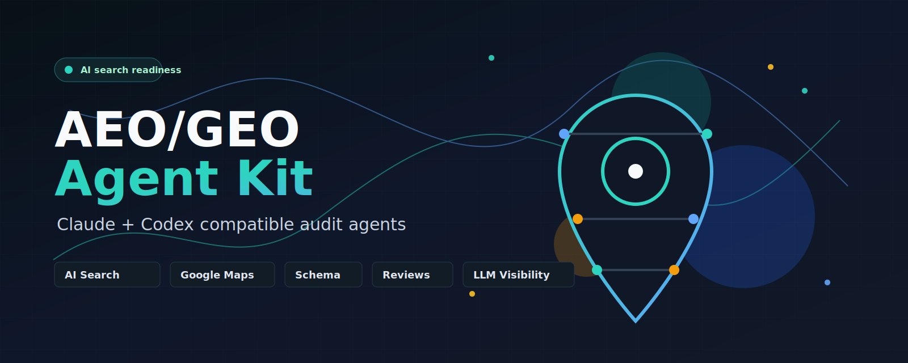

# AEO/GEO Agent Kit



Claude- and Codex-compatible AEO/GEO agent kit for auditing AI search, Google Maps, schema, reputation, NAP, links, and LLM visibility.

This kit helps evaluate whether a business is ready to be discovered, understood, trusted, recommended, and cited across:

- AI answer engines and LLMs
- Google AI search surfaces
- Google Maps and local search
- Schema/entity search
- Review and reputation systems
- Local citations, links, and third-party authority signals

## What's Included

- `skills/aeo-geo-audit/` - Codex-compatible skill pack
- `.claude/skills/aeo-geo-audit/` - Claude-compatible bridge skill
- `manifests/agent-roster.yaml` - coordinator and sub-agent ownership map
- `agent-pack/` - portable multi-agent workflow notes
- `agents/` - standalone agent prompt files
- `references/` - repo-level supporting references
- `assets/` - repository preview and visual assets
- `examples/audit-request.md` - copy-ready audit prompts
- `INSTALL.md` - setup notes for Codex and Claude
- Sub-agent prompts for crawl, schema, content, local Maps/NAP, reviews, links, and LLM visibility
- Scoring rubric
- Audit framework
- LLM prompt library
- Tool and data-source guide
- Audit report and remediation roadmap templates

## Basic Use

In Codex:

```text
Use $aeo-geo-audit to audit [company name] at [URL].
```

In Claude:

```text
Use the aeo-geo-audit skill to audit [company name] at [URL].
```

Recommended inputs:

- Company name
- Website URL
- Primary location or service area
- Target customers
- Competitors, if known

## Optional Dashboard

The repo includes a static dashboard builder with no external npm dependencies:

```bash
npm install
npm run build:dashboard
npm audit
```

## Audit Coverage

The audit workflow covers:

- Technical crawlability and indexability
- Schema and entity clarity
- AEO/GEO answer readiness
- Google Maps and local readiness
- NAP and citation consistency
- Reputation and reviews
- Authority, links, and mentions
- LLM visibility and citation likelihood
- Conversion trust

## Notes

AI search behavior changes quickly. The skill intentionally requires evidence, dates, and source notes for platform-specific observations instead of assuming stable rankings or fixed LLM behavior.
